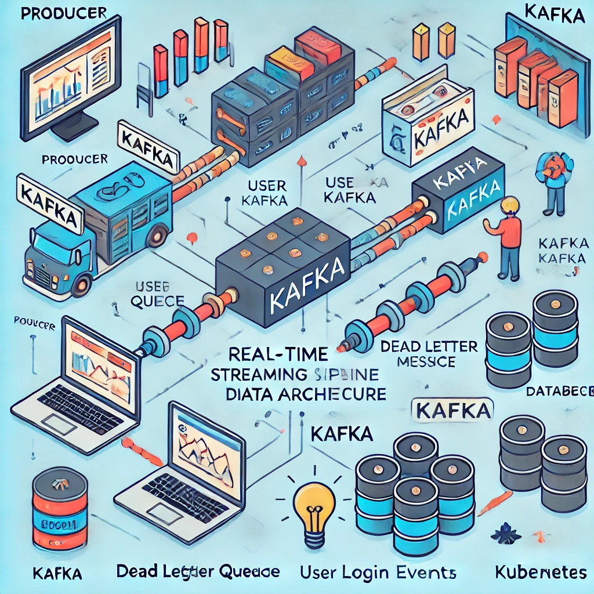

(base) ➜  kafka-pipeline git:(main) ✗ cat README.md 


## Table of Contents

* **[Introduction](#introduction)**
* **[Key Features](#key_features)**
    * [Kafka Consumer & Producer Integration](#key_features_kafka_consumer_and_producer_itegration)
    * [Message Processing & Validation](#key_features_message_processing_and_validation)
    * [Retry Logic for Kafka Message Publishing](#key_features_retry_logic_for_kafka_message_publishing)
    * [Prometheus Metrics for Monitoring](#key_features_prometheus_metrics_for_monitoring)
    * [Graceful Shutdown](#key_features_graceful_shutdown)
    * [Worker Pool for Concurrent Message Processing](#key_features_worker_pool_for_concurrent_message_processing)
    * [Private IP Filtering](#key_features_private_ip_filtering)
    * [Dead Letter Queue (DLQ)](#key_features_dead_letter_queue)

* **[Design Choices](#design_choices)**
    * [Consumer Component Features](#consumer_component_features)
    * [Consumer Flow](#consumer_flow)

* **[Consumer Documentation](#consumer_documentation)**
    * [Consumer Overview](#consumer_documentation_overview)
    * [Consumer Design Choices](#consumer_documentation_design_choices)
    * [Consumer Component Features](#consumer_component_features)
    * [Consumer Flow](#consumer_flow)
    * [Consumer Environment Configuraton](#consumer_environment_configuration)
    * [Consumer Docker Configuraton](#consumer_docker_configuration)
    * [Consumer Logging and Monitoring](#consumer_logging_and_monitoring)
    * [Consumer Directory Laout](#consumer_documentation_directory_layout)
    * [Consumer Implementation](#consumer_implementation)
    * [Consumer Unit Tests](#consumer_documentation_unit_tests)
    * [Consumer Production Notes](#consumer_documentation_production_notes)

* **[Production Readiness](#production_readiness)**
    * [Common Steps](#producton_readiness_common_steps)
    * [Enhancements](#producton_readiness_enhancements)

* **[Project Deployment](#project_deployment)**
    * [Running the Project Locally](#running_locally)
    * [Production Deployment Steps](#production_deployment_steps)
    * [Deploying In The Cloud](#deploying_in_the_cloud)
    * [Deploying in Non-Cloud Environments](#deploying_in_non_cloud)
    * [Deployment Commands](#deployment_commands) 
    * [Kubernetes and Container Orchestration](#production_kubernetes_orchestration)
    * [Logging and Alerging](#logging_and_alerging)


* **[Security and Compliance](#security_and_compliance)**
* **[Scalability](#scalability)**
    * [Scalability Overview](#scalability_overview)
    * [Horizontal Scaling of Kafka Brokers (Non-Cloud)](#scalability_horizontal_scaling_kafka_brokers_non_cloud)
    * [Horizontal Scaling of Kafka Brokers with Managed Kubernetes and Cloud Services](#scalability_horizontal_scaling_kafka_brokers_kubernetes_cloud)
    * [Managed Cloud Services for Fault Tolerance and High Availability (AWS, GCP, Azure)](#scalability_managed_cloud_services_for_fault_tolerance)
    * [Consumer Group Scaling (Non-Cloud and Cloud)](#scalability_consumer_groups)
    * [Leveraging Cloud-Native Monitoring and Auto-Scaling](#scalability_cloud_native_monitoring_autoscaling)
    * [Elasticity of Kafka with Cloud Infrastructure](#scalability_elasticity_cloud)
    * [Consumer Group Scaling](#scalability_consumer_group_scaling)
    * [Data Replication and Fault Tolerance](#scalability_data_replication_fault_tolerance)
    * [Consumer Processing Pipeline Scalability](#scalability_consumer_processing_pipeline_scalability)
    * [Conclusion](#scalability_conclusion)

* **[Troubleshooting Tips](#troublesooting_tips)**

* **[Conclusion](#conclusion)**


## Introduction <a name="introduction"></a>

This project implements a real-time data streaming pipeline using **Apache Kafka**, **Docker**, and **Go**. It involves creating a system to consume, process, and produce data messages in Kafka topics, while ensuring scalability, fault tolerance, and efficient message handling. The pipeline consists of the following components:

1. **Kafka** for message ingestion and distribution.
2. **Docker** for containerization of services.
3. **Go-based consumer service** to process and produce data.
4. **Python-based producer service** for simulating data generation and pushing it to Kafka.

The solution involves setting up a Kafka consumer in Go that consumes messages from a Kafka topic (`user-login`), processes them based on certain rules, and publishes the processed data to another Kafka topic (`processed-user-login`). Any invalid messages are sent to a Dead Letter Queue (DLQ) topic (`user-login-dlq`). 

## Key Features <a name="key_features"></a>
- **Kafka consumer**: Reads messages from a Kafka topic (`user-login`), processes them based on certain checks, and publishes valid messages to the `processed-user-login` topic.
- **Dead Letter Queue (DLQ)**: Invalid messages are sent to the `user-login-dlq` topic.
- **Fault tolerance and retries**: The consumer ensures that messages are processed even in case of temporary issues, using retry logic with exponential backoff.
- **Graceful shutdown**: The application handles shutdown signals to close Kafka consumer and producer connections cleanly.


### 1. **Kafka Consumer & Producer Integration** <a name="key_features_kafka_consumer_and_producer_itegration"></a>
   - **What it does**: This feature allows the application to consume messages from a Kafka topic, process them, and then produce the processed messages to another Kafka topic or Dead Letter Queue (DLQ) if the message is invalid.
   - **Motivation**: Kafka is used for its ability to handle high-throughput data streams in a fault-tolerant manner. This feature integrates seamlessly with Kafka to support real-time streaming and processing.
   - **How it was implemented**:
     - The `kafka.NewConsumer` and `kafka.NewProducer` functions are used to initialize Kafka consumer and producer instances.
     - A consumer subscribes to the input topic, polls for new messages, and forwards them to a worker pool for processing.
     - The producer is responsible for publishing processed messages to the output topic, or failing that, to the DLQ.
   - **How it should be tested**:
     - Unit tests can validate Kafka message consumption and production by mocking the `ConsumerInterface` and `ProducerInterface` with predefined messages.
   - **How it addresses issues**:
     - This feature enables real-time processing of Kafka streams, crucial for high-volume, low-latency data pipelines as required in the assignment.

### 2. **Message Processing & Validation** <a name="key_features_message_processing_and_validation"></a>
   - **What it does**: Each message is processed and validated before being forwarded. Invalid messages are sent to a Dead Letter Queue (DLQ) for further investigation.
   - **Motivation**: To ensure data integrity, only valid messages based on certain criteria (e.g., presence of `UserID`, valid `AppVersion`, etc.) are allowed to proceed to the output topic.
   - **How it was implemented**:
     - The `processMessage` function handles unmarshalling, validation, and processing of incoming messages. Valid messages are transformed and timestamped as `ProcessedMessage`.
     - Invalid messages are identified and logged, and they are then sent to the DLQ using the `publishWithRetry` function to ensure fault tolerance.
   - **How it should be tested**:
     - Unit tests for message validation (e.g., ensuring that missing or invalid fields cause the message to be rejected).
     - Simulating both valid and invalid messages should trigger the correct flow (either processing or DLQ publishing).
   - **How it addresses issues**:
     - The feature helps maintain the integrity of the data pipeline by preventing invalid data from being processed, ensuring downstream systems receive clean data.

### 3. **Retry Logic for Kafka Message Publishing** <a name="key_features_retry_logic_for_kafka_message_publishing"></a>
   - **What it does**: When publishing a message to Kafka, if the operation fails, the application will retry the operation up to a specified number of attempts, with a delay between retries.
   - **Motivation**: Retry logic improves fault tolerance, ensuring that transient errors in Kafka publishing do not result in lost data.
   - **How it was implemented**:
     - The `publishWithRetry` function is responsible for retrying message publication. It retries a maximum of `retries` times with a `delay` between attempts.
   - **How it should be tested**:
     - Mocking Kafka's producer failures and ensuring that the retry logic is triggered and the correct number of attempts is made before failing.
   - **How it addresses issues**:
     - This retry mechanism helps mitigate issues where transient network or Kafka broker failures may prevent message delivery, improving the reliability of the system.

### 4. **Prometheus Metrics for Monitoring** <a name="key_features_prometheus_metrics_for_monitoring"></a>
   - **What it does**: This feature integrates Prometheus for real-time monitoring of Kafka message processing. It tracks the number of successfully processed messages, as well as failed ones sent to the DLQ.
   - **Motivation**: Monitoring metrics are critical for observing the health of the system, understanding message processing volumes, and detecting issues early.
   - **How it was implemented**:
     - A Prometheus counter, `kafkaMessagesProcessed`, is incremented every time a message is successfully processed or sent to the DLQ.
     - A Prometheus metrics server is started on port `9090` using the `promhttp.Handler` to expose these metrics to Prometheus for scraping.
   - **How it should be tested**:
     - Integration tests can be written to confirm that the metrics are correctly incremented when messages are processed or failed.
     - A manual test could involve verifying that the metrics endpoint (`/metrics`) is accessible and showing correct data.
   - **How it addresses issues**:
     - Prometheus monitoring ensures that the system’s health can be tracked continuously, helping quickly detect performance or operational issues in the Kafka message pipeline.

### 5. **Graceful Shutdown** <a name="key_features_graceful_shutdown"></a>
   - **What it does**: The system handles signals like `SIGINT` and `SIGTERM` to gracefully shut down the Kafka consumer and producer, ensuring no data is lost during shutdown.
   - **Motivation**: Graceful shutdown ensures that the system can stop cleanly without losing messages in-flight or causing data corruption.
   - **How it was implemented**:
     - The `handleSignals` function listens for termination signals and invokes a cancel function to stop message processing.
     - Once the signal is received, it shuts down the Kafka consumer and producer in an orderly manner, ensuring that no message is left unprocessed.
   - **How it should be tested**:
     - Test by simulating signals (e.g., `SIGINT` or `SIGTERM`) and verifying that the system stops gracefully without data loss.
   - **How it addresses issues**:
     - Ensures system stability and data integrity during shutdown, preventing issues with incomplete message processing.

### 6. **Worker Pool for Concurrent Message Processing** <a name="key_features_worker_pool_for_concurrent_message_processing"></a>
   - **What it does**: A worker pool processes messages concurrently to ensure efficient message handling and prevent bottlenecks in the data pipeline.
   - **Motivation**: The worker pool allows the system to scale efficiently by processing multiple messages concurrently, which is crucial for high-throughput Kafka topics.
   - **How it was implemented**:
     - A worker pool is created with a fixed number of workers (`workerPoolSize`). Each worker listens for messages and processes them independently.
     - The workers are synchronized using a `sync.WaitGroup` to ensure that all processing is completed before the program terminates.
   - **How it should be tested**:
     - Unit tests can check that multiple workers are correctly processing messages in parallel.
     - Integration tests could simulate high message volumes to ensure that the system handles them efficiently.
   - **How it addresses issues**:
     - The worker pool enables parallel processing, which helps scale the system and ensures that the application can handle large volumes of messages.

### 7. **Private IP Filtering** <a name="key_features_private_ip_filtering"></a>
   - **What it does**: This feature filters out messages originating from private IP addresses to ensure that only valid, external data is processed.
   - **Motivation**: Filtering private IP addresses prevents internal traffic from contaminating the data pipeline, ensuring that only relevant data is processed.
   - **How it was implemented**:
     - The `isPrivateIP` function checks if the IP address in a message is a private IP (i.e., within reserved ranges). If it is, the message is rejected.
   - **How it should be tested**:
     - Tests should verify that messages from private IPs are rejected and that the correct log messages are generated.
   - **How it addresses issues**:
     - Helps maintain the quality of data by ensuring that only external sources are processed.

### 8. **Dead Letter Queue (DLQ)** <a name="key_features_dead_letter_queue"></a>
   - **What it does**: Invalid messages are routed to a Dead Letter Queue (DLQ) for further investigation, ensuring that processing continues for valid messages even in the case of errors.
   - **Motivation**: To ensure that invalid or corrupted messages do not interfere with normal processing while still allowing for troubleshooting and further action.
   - **How it was implemented**:
     - The `publishToDLQ` function sends invalid messages to the `user-login-dlq` Kafka topic. This process is triggered when a message fails validation or processing.
   - **How it should be tested**:
     - Unit tests can simulate invalid messages and confirm that they are correctly routed to the DLQ.
   - **How it addresses issues**:
     - DLQ provides a mechanism for isolating erroneous messages, ensuring that they do not block the flow of valid messages through the system.

---

## Design Choices <a name="design_choices"></a>

### 1. **Kafka Topics and Data Flow**
   - **Input Topic**: `user-login` – This is the main topic where messages are consumed from. Messages in this topic are expected to contain user login information in JSON format.
   - **Output Topic**: `processed-user-login` – After processing, valid messages are published to this topic.
   - **Dead Letter Queue (DLQ)**: `user-login-dlq` – Any invalid messages (e.g., missing fields or invalid data) are sent to this DLQ for further inspection.

### 2. **Consumer Logic in Go**
   - The consumer subscribes to the `user-login` topic.
   - It processes each message and validates fields like `UserID`, `AppVersion`, and `DeviceType`. If a message fails validation, it is sent to the DLQ.
   - The consumer uses a worker pool model to handle message processing concurrently, improving throughput.
   - Kafka consumer offsets are managed manually to provide greater control over message acknowledgment, which ensures that messages are not lost in case of a failure.

### 3. **Choice of Kafka, third party libraries and implementaton language** 
   - **Design Priorities**: The design is built with efficiency, scalability, and fault tolerance in mind. 
   - **Go as the programming language**: Go was chosen for its lightweight, asynchronous, and efficient nature. It is well-suited for building scalable and performant systems that interact with Kafka, where message consumption and processing can occur concurrently without blocking other operations. Go's simplicity, fast compilation time, and robust concurrency model (goroutines and channels) make it an ideal choice for this type of real-time data pipeline.
   - **`confluentinc/confluent-kafka-go`**: This library was selected for its minimal configuration, high performance, and strong integration with the Confluent Kafka ecosystem. It provides a reliable, efficient, and straightforward interface for Kafka consumers and producers, making it the most practical choice for this project. Alternatives like `goka`, `kafka-go`, and `Shopify/sarama` could also be used, but `confluent-kafka-go` was chosen due to its direct support for Kafka's native protocol and integration with Kafka.
   - **Kafka as the backbone of the data pipeline**: Kafka is used for handling high throughput of streaming data. Kafka's partitioning model and fault tolerance through replication provide scalability and reliability, ensuring the system can handle large volumes of data without significant performance degradation.

### 4. **Fault Tolerance and Scalability**
   - **Retries**: The consumer implements exponential backoff for retries to avoid overloading the Kafka brokers in case of transient issues.
   - **Concurrency**: A worker pool is used to process multiple messages concurrently, improving throughput and scalability.
   - **Graceful Shutdown**: The consumer listens for termination signals (e.g., SIGTERM) and shuts down Kafka connections cleanly, ensuring no data is lost.


## Consumer Documentation <a name="consumer_documentation"></a>

### Overview <a name="consumer_documentation_overview"></a>

The consumer component is designed to consume messages from a Kafka topic, validate and process those messages, and forward valid messages to another Kafka topic. It also handles invalid messages by placing them in a Dead Letter Queue (DLQ). This consumer is built to be highly robust, with error handling, retries, graceful shutdown, and filtering features.

### Design Choices <a name="consumer_documentation_design_choices"></a>
This consumer application is written in ```Go``` and leverages the ```confluentinc/confluent-kafka-go``` library for interacting with Apache Kafka. This choice offers several advantages:
   - **Go**: ```Go``` is a performant, statically typed language with excellent concurrency features, making it well-suited for building scalable and reliable message processing applications like this consumer.
   - **confluentinc/confluent-kafka-go**: This popular ```Go``` library provides a mature and user-friendly API for interacting with Kafka clusters. It offers features for consumer group management, message consumption, and producer functionality.


### Consumer Implementation <a name="consumer_implementation"></a>

#### ```main.go``` Breakdown <a name="consumer_documentation_main_go"></a>
The ```main.go``` file serves as the entry point for the consumer application. It defines various functions responsible for Kafka configuration, message processing, and graceful shutdown. Let's delve into each function's purpose, arguments, and return values.


#### Imports Overview
---
The following Go packages and external libraries are used in the application:

##### Standard Library Packages:
- **`context`**: Provides context management for cancellations, deadlines, and metadata across API boundaries.
- **`encoding/json`**: Enables encoding and decoding of JSON data.
- **`fmt`**: Used for formatted I/O operations.
- **`log`**: Provides logging capabilities for the application.
- **`net`**: Used for networking utilities like IP validation.
- **`os`**: Offers functionality for interacting with the operating system, such as environment variables and signals.
- **`os/signal`**: Facilitates handling of operating system signals.
- **`strings`**: Provides functions for string manipulation.
- **`sync`**: Offers concurrency primitives such as `WaitGroup`.
- **`syscall`**: Used for low-level system call handling.
- **`time`**: Handles time-based operations, such as delays and timestamps.

##### External Libraries:
- **`github.com/confluentinc/confluent-kafka-go/v2/kafka`**: Official Go client for Apache Kafka, used for producing and consuming messages.
- **`github.com/prometheus/client_golang/prometheus`**: Prometheus library for defining and managing custom metrics.
- **`github.com/prometheus/client_golang/prometheus/promhttp`**: Provides an HTTP handler for exposing Prometheus metrics.

##### Additional Libraries:
- **`net/http`**: Facilitates HTTP server implementation for metrics endpoint.

##### Note:
- These imports enable essential functionalities, such as Kafka communication, Prometheus metrics tracking, HTTP server setup, and concurrent processing.


#### Consumer Data Types <a name="consumer_documentation_data_types"></a>
---
This section describes the data types (structs) used in the consumer application.


##### `Message`
```go
type Message struct {
    UserID     string `json:"user_id"` 
    AppVersion string `json:"app_version"`
    DeviceType string `json:"device_type"`
    IP         string `json:"ip"`
    Locale     string `json:"locale"` 
    DeviceID   string `json:"device_id"`
    Timestamp  int64  `json:"timestamp"`
}
```

**Description**:
This struct represents the structure of a raw message consumed from the Kafka input topic. It contains the necessary fields that are expected in the message.

**Fields**:
- `UserID` (type: `string`): The ID of the user associated with the message.
- `AppVersion` (type: `string`): The version of the application sending the message.
- `DeviceType` (type: `string`): The type of device used by the user.
- `IP` (type: `string`): The IP address of the device sending the message.
- `Locale` (type: `string`): The locale (language/region) of the user.
- `DeviceID` (type: `string`): The unique identifier of the device. 
- `Timestamp` (type: `int64`): The timestamp when the message was created. 

**Purpose**:
- This struct is used to unmarshal the raw JSON message received from Kafka.
- It serves as the base structure for validating and processing the message.

---

##### `ProcessedMessage`
```go
type ProcessedMessage struct {
    Message
    ProcessedAt string `json:"processed_at"`
}
```

**Description**:
This struct extends the `Message` struct and represents a processed message that includes a timestamp indicating when it was processed.

**Fields**:
- `Message` (type: `Message`): The original message, including all fields from the `Message` struct.
- `ProcessedAt` (type: `string`): The timestamp indicating when the message was processed, formatted in RFC3339 format.

**Purpose**:
- This struct is used to represent the message after it has been validated and processed, including a `ProcessedAt` timestamp.
- It is used for marshalling and publishing the processed message to the Kafka output topic.


#### Consumer Functions <a name="consumer_documentation_functions"></a>
---

This section provides a comprehensive overview of all functions implemented in `main.go`, including their purposes, input arguments, and returned values.

#### `publishWithRetry(producer *kafka.Producer, topic string, message []byte, retries int, delay time.Duration)`

**Description**:
This function attempts to publish a message to a Kafka topic. If the publishing fails, it retries the operation with a specified delay between attempts, up to a maximum number of retries.

**Input Arguments**:
- `producer`: The Kafka producer used to publish the message (type: `*kafka.Producer`).
- `topic`: The Kafka topic to publish the message to (type: `string`).
- `message`: The message to be published (type: `[]byte`).
- `retries`: The maximum number of retry attempts (type: `int`).
- `delay`: The delay duration between retry attempts (type: `time.Duration`).

**Returned Values**:
- Returns `nil` if the message is successfully published.
- Returns an `error` if all retries fail.

**Functionality**:
- Prepares the Kafka message with the specified topic and message payload.
- Publishes the message using the provided Kafka producer.
- If publishing fails, logs the error and retries the operation after waiting for the specified delay.
- Returns the last encountered error if all retry attempts are unsuccessful.

**Example Usage**:
```go
producer, err := kafka.NewProducer(&kafka.ConfigMap{
    "bootstrap.servers": "localhost:9092",
})
if err != nil {
    log.Fatalf("Failed to create producer: %v", err)
}
defer producer.Close()

message := []byte("Hello, Kafka!")
topic := "example-topic"
retries := 5
delay := 2 * time.Second

err = publishWithRetry(producer, topic, message, retries, delay)
if err != nil {
    log.Fatalf("Failed to publish message: %v", err)
} else {
    log.Println("Message successfully published.")
}

```


#### `isPrivateIP(ip string) bool`

**Description**:  
This function checks if a given IP address is a private IP address.

**Input Arguments**:  
- `ip` (`string`): The IP address to check, represented as a string.

**Returned Values**:  
- Returns `true` if the provided IP address is private.  
- Returns `false` otherwise.

**Functionality**:  
1. Parses the input string to validate its format as an IP address.  
2. Checks if the IP address falls within the ranges defined for private IP addresses:  
   - `10.0.0.0` to `10.255.255.255` (Class A)  
   - `172.16.0.0` to `172.31.255.255` (Class B)  
   - `192.168.0.0` to `192.168.255.255` (Class C)  
3. Returns `true` if the IP matches any of the above ranges; otherwise, returns `false`.

**Example Usage**:  
```go
ip := "192.168.1.1"
if isPrivateIP(ip) {
    fmt.Printf("%s is a private IP address.\n", ip)
} else {
    fmt.Printf("%s is not a private IP address.\n", ip)
}

```


#### `isValidMessage(msg Message) bool`

**Description**:  
This function checks if a `Message` instance satisfies validation criteria to be considered valid.

**Input Arguments**:  
- `msg` (`Message`): The message object to validate, typically consisting of fields like `Key`, `Value`, and any additional metadata.

**Returned Values**:  
- Returns `true` if the message meets all validation criteria.  
- Returns `false` otherwise.

**Functionality**:  
1. Ensures the `Key` field of the message is non-empty, as it may be used to partition messages or maintain uniqueness.  
2. Validates that the `Value` field is non-empty to ensure the message contains meaningful content.  
3. Performs additional checks as necessary to confirm the message adheres to the application's specific requirements.

**Example Usage**:  
```go
msg := Message{
    Key:   "exampleKey",
    Value: []byte("exampleValue"),
}

if isValidMessage(msg) {
    fmt.Println("The message is valid.")
} else {
    fmt.Println("The message is invalid.")
}
```


##### `processMessage(message []byte) ([]byte, error)`

**Description**:  
Processes a Kafka message by performing necessary transformations.

**Input Arguments**:
- `message`: The Kafka message to process (type: `[]byte`).

**Returned Values**:
- `[]byte`: The processed message ready for publishing.
- `error`: Returns an error if the message processing fails.

**Functionality**:
- Parses the message and applies business logic transformations.
- Returns the modified message or an error if processing fails.

---


##### `processMessages(ctx context.Context, messageChan <-chan *kafka.Message, producer *kafka.Producer, outputTopic, dlqTopic string)`

**Description**:  
This function processes Kafka messages from the input channel, applies validation, and routes messages to the appropriate Kafka topic. It handles invalid messages by publishing them to a Dead Letter Queue (DLQ) topic.

**Input Arguments**:  
- `ctx`: A `context.Context` used to manage cancellation and deadlines for processing.  
- `messageChan`: A channel (`<-chan *kafka.Message`) from which incoming Kafka messages are received.  
- `producer`: A Kafka producer (`*kafka.Producer`) used for sending messages to Kafka topics.  
- `outputTopic`: The Kafka topic to which valid messages are published (`string`).  
- `dlqTopic`: The Kafka topic to which invalid messages are routed (`string`).  

**Returned Values**:  
- None (this function does not return any values).

**Functionality**:  
1. Listens to incoming Kafka messages from `messageChan`.  
2. For each message:
   - Validates the message using a validation function (e.g., `isValidMessage`).  
   - Publishes valid messages to the specified `outputTopic`.  
   - Routes invalid messages to the `dlqTopic`.  
3. Handles errors and ensures processing continues gracefully.  
4. Respects the context for graceful shutdown or cancellation.

**Example Usage**:  
```go
ctx, cancel := context.WithCancel(context.Background())
defer cancel()

messageChan := make(chan *kafka.Message)
producer := createProducer() // Assume createProducer initializes a Kafka producer.
outputTopic := "processed-messages"
dlqTopic := "dead-letter-queue"

go processMessages(ctx, messageChan, producer, outputTopic, dlqTopic)

```

---
##### `handleSignals(cancel context.CancelFunc, consumer *kafka.Consumer, producer *kafka.Producer)`

**Description**:  
This function listens for system signals to gracefully shut down the Kafka consumer, producer, and other application resources. It ensures proper cleanup during application termination.

**Input Arguments**:  
- `cancel`: A `context.CancelFunc` used to cancel any active contexts and signal shutdown.  
- `consumer`: The Kafka consumer (`*kafka.Consumer`) to be closed during shutdown.  
- `producer`: The Kafka producer (`*kafka.Producer`) to be closed during shutdown.  

**Returned Values**:  
- None (this function does not return any values).

**Functionality**:  
1. Waits for OS signals such as `SIGINT` or `SIGTERM` using a signal channel.  
2. Upon receiving a signal:
   - Calls `cancel` to terminate active contexts.  
   - Closes the Kafka consumer and producer to release resources.  
   - Logs the shutdown process for observability.  

**Example Usage**:  
```go
ctx, cancel := context.WithCancel(context.Background())
defer cancel()

consumer := createConsumer() // Assume createConsumer initializes a Kafka consumer.
producer := createProducer() // Assume createProducer initializes a Kafka producer.

go handleSignals(cancel, consumer, producer)

// Application logic here...
```
**Notes**:
- This function is designed to run concurrently, typically in a goroutine, to handle signals without blocking main application logic.
- Ensure proper error handling when closing the consumer and producer to manage edge cases.
- Always use this function to enable graceful shutdown in Kafka-based applications.

---

##### `startMetricsServer()`

**Description**:
Start Prometheus Metrics Server.

**Input Arguments**:
- None.

**Returned Values**:
- None.

**Functionality**:
- Start Prometheus Metrics Server.

**Example Usage**:
```go
startMetricsServer()
```

---

##### `init()`


**Description**:  
The `init` function initializes necessary configurations and resources before the program executes the `main` function. It is called automatically by Go during the program's initialization phase.

**Input Arguments**:  
- None (this is a Go standard initialization function and takes no arguments).

**Returned Values**:  
- None (this function does not return any values).

**Functionality**:  
1. Loads configuration parameters, such as environment variables, if required by the application.  
2. Initializes global variables or shared resources used throughout the application.  
3. Ensures that essential setup steps are completed before the program starts executing the main logic.  

**Example Usage**:  
This function is called automatically and does not need to be explicitly invoked in the code.  

```go
func init() {
    // Example: Set default configurations or environment variables
    log.Println("Initializing application configurations...")
    prometheus.MustRegister(kafkaMessagesProcessed)
}
---

##### `main()`

**Description**:  
The entry point of the application, orchestrating the setup and execution of the Kafka consumer and producer.

**Input Arguments**:
- None.

**Returned Values**:
- None.

**Functionality**:
- Reads environment variables for Kafka configurations.
- Sets up Kafka consumer and producer instances.
- Subscribes to the input topic and starts message processing.
- Handles graceful shutdown upon receiving termination signals.


### Consumer Component Features <a name="consumer_component_features"></a>

#### 1. **Message Validation and Filtering**
   - **Purpose**: Ensures that each message contains required fields and adheres to a predefined schema.
   - **Fields Checked**: 
     - `UserID`: The identifier for the user.
     - `AppVersion`: The version of the app generating the event.
     - `DeviceType`: The type of device the user is using (e.g., mobile, desktop).
   - **Action**: 
     - Valid messages are forwarded to the `processed-user-login` Kafka topic.
     - Invalid messages are placed into a Dead Letter Queue (DLQ) (`user-login-dlq`) for further inspection.

#### 2. **Error Handling and Retry Logic**
   - **Purpose**: Ensures that transient errors do not cause message loss.
   - **How It Works**: 
     - The consumer retries message processing up to a defined number of times if temporary errors occur (e.g., Kafka unavailability or validation issues).
     - If all retry attempts are exhausted, the message is sent to the DLQ.
     - Errors during message consumption or processing are logged for monitoring and debugging.

#### 3. **Graceful Shutdown**
   - **Purpose**: Ensures that the consumer can gracefully shut down, processing any in-flight messages before exiting.
   - **How It Works**: 
     - Upon receiving shutdown signals (`SIGINT`, `SIGTERM`), the consumer stops consuming new messages and finishes processing the current batch.
     - Logs and metrics are flushed before the consumer stops.

#### 4. **Backpressure Handling**
   - **Purpose**: Prevents the system from being overwhelmed by too many messages.
   - **How It Works**: 
     - The consumer implements rate-limiting and backpressure handling by controlling the rate at which messages are consumed and processed.
     - This helps manage high message throughput and ensures the system does not exceed capacity.

#### 5. **Logging and Metrics**
   - **Purpose**: Tracks and logs the consumer’s activity for monitoring and troubleshooting.
   - **Log Types**: 
     - **Success Logs**: Log entries for successfully processed messages.
     - **Error Logs**: Log entries for message validation failures and retry attempts.
     - **Retry Logs**: When a message is retried due to transient issues.
   - **Metrics**:
     - **Message Consumption Rate**: Tracks how fast messages are being consumed.
     - **Retry Count**: Number of times a message has been retried.
     - **DLQ Count**: Number of messages that have been sent to the Dead Letter Queue.
     - **Message Processing Time**: The time taken to process each message.
   - **Integration**: The logs can be forwarded to centralized logging systems like Datadog or ELK for detailed monitoring.

#### 6. **Dead Letter Queue (DLQ)**
   - **Purpose**: Holds messages that cannot be processed due to validation errors or failures after retry attempts.
   - **How It Works**: 
     - If a message fails validation or processing after the retry limit, it is sent to a Kafka topic (`user-login-dlq`).
     - This ensures that no data is lost and can be inspected manually or reprocessed later.

#### 7. **Kafka Consumer Group**
   - **Purpose**: Allows multiple consumer instances to share the load of consuming messages from Kafka.
   - **How It Works**: The consumer is part of a Kafka consumer group that distributes partitions across all instances of the consumer, ensuring load balancing and fault tolerance.

#### 8. **Scalability**
   - **Purpose**: Allows the consumer to scale horizontally to handle increased load.
   - **How It Works**: 
     - To scale the consumer, you can increase the number of consumer instances in the same Kafka consumer group.
     - Kafka automatically balances the load by distributing topic partitions across the available consumers.


### Consumer Flow <a name="consumer_flow"></a>

1. **Consume Message**: The consumer listens to the `user-login` Kafka topic.
2. **Message Validation and Filtering**: Each message is validated for required fields (`UserID`, `AppVersion`, `DeviceType`). Invalid messages are forwarded to the DLQ, while valid messages are processed further.
3. **Retry Logic**: If a transient failure occurs (e.g., network issues), the message will be retried a predefined number of times.
4. **Forward Valid Message**: Valid messages are forwarded to the `processed-user-login` topic.
5. **Graceful Shutdown**: Upon receiving a shutdown signal, the consumer gracefully finishes processing messages and exits.

### Consumer Environment Configuration <a name="consumer_environment_configuration"></a>

The consumer is configured via the `.env` file and can be customized with the following parameters:

- `KAFKA_BOOTSTRAP_SERVERS`: The address of the Kafka broker (e.g.,`kafka:9092`).
- `KAFKA_BOOTSTRAP_HOST`: Kafka host for healthcheck purposes only in Consumer container.
- `KAFKA_BOOTSTRAP_PORT`: Kafka port for healthcheck purposes only in Consumer container.
- `KAFKA_INPUT_TOPIC`: The Kafka topic to consume messages from (`user-login`).
- `KAFKA_OUTPUT_TOPIC`: The Kafka topic to send valid, processed messages to (`processed-user-login`).
- `KAFKA_DLQ_TOPIC`: The topic for invalid messages (`user-login-dlq`).
- `KAFKA_CONSUMER_GROUP`: The name of the consumer group (used for consumer group management in Kafka).
- `KAFKA_RETRY_LIMIT`: The maximum number of retry attempts for a message before it is sent to the DLQ.
- `KAFKA_SESSION_TIMEOUT`: Kafka optional session timeout variable.
- `KAFKA_SOCKET_TIMEOUT`: Kafka optional socket timeout variable.
- `KAFKA_AUTO_OFFSET_RESET`: Kafka auto offet reset can be set to "earliest", "latest", and "none".
- `KAFKA_ENABLE_AUTO_COMMIT`: Autocommit can be set to true or false,


### Consumer Docker Configuration <a name="consumer_docker_configuration"></a>

The consumer is containerized using Docker. Below is the `Dockerfile` and `docker-compose.yml` used for the consumer service.

#### Dockerfile

```Dockerfile
# Use the latest  Go image
FROM golang:1.23.4

# Set the working directory
WORKDIR /app

# Copy go.mod and go.sum files
COPY go.mod go.sum ./

# Download dependencies
RUN go mod download

# Copy the application code
COPY . .

# Build the Go application
RUN go build -o data-consumer main.go

# Run the Go application
CMD ["./data-consumer"]
```

### docker-compose.yml 
```docker-compose.yml

services:
  data-consumer:
    container_name: ${PROJECT_NAME}-consumer
    env_file:
      - .env
    build:
      context: ./data-consumer
    depends_on:
      - kafka
    networks:
      - kafka-network
```


### Consumer Logging and Monitoring <a name="consumer_logging_and_monitoring"></a>


### Consumer Directory Layout <a name="consumer_documentation_directory_layout"></a>
The consumer logic resides within the data-consumer directory. Here's a breakdown of its contents:

```
data-consumer/
├── Dockerfile          (Docker build configuration)
├── go.mod              (Go module dependency file)
├── go.sum               (Checksum file for dependencies)
├── main_test.go         (Unit Tests to the functions in main.go)
└── main.go              (Go source code for the consumer application)
```

### Consumer Unit Tests <a name="consumer_documentation_unit_tests"></a>

This section provides an overview of the unit tests for the `main.go` file and the consumer service. The tests cover a wide range of scenarios, ensuring that the core functionalities of message processing, Kafka communication, and Prometheus metrics behave as expected. The goal is to verify the correctness, reliability, and resilience of the system without depending on external services such as Kafka.

#### Test Suite Overview

The test suite includes the following key tests:

- **TestProcessMessage_ValidMessage**: Verifies that a valid message is correctly processed, resulting in a correctly formatted processed message.
- **TestProcessMessage_InvalidMessage**: Ensures that an invalid message (missing required fields) is properly handled by returning `nil` and `false`.
- **TestIsPrivateIP**: Tests the `isPrivateIP` function, checking that it correctly identifies whether an IP address is private or public.
- **TestPublishWithRetry_Success**: Simulates the successful production of a Kafka message and ensures that the retry mechanism works correctly on the first attempt.
- **TestPublishWithRetry_Failure**: Simulates multiple failures of Kafka message production and verifies that the retry mechanism retries the specified number of times before failing.
- **TestKafkaMessagesProcessedMetric**: Validates that the Prometheus metric for Kafka message processing is incremented when a message is successfully processed.
- **TestGracefulShutdown**: Tests the graceful shutdown logic of the application, ensuring that the consumer and producer resources are properly closed.

#### Data Structures Used

- **Message**: Represents the incoming Kafka message. The structure contains fields such as `UserID`, `AppVersion`, `DeviceType`, `IP`, `Locale`, `DeviceID`, and `Timestamp`. This structure is used to simulate real incoming messages that are processed by the system.
  
- **ProcessedMessage**: Represents the processed form of the `Message`. This structure is used to hold the processed data after the message has been validated and parsed.

- **MockProducer**: A mock implementation of a Kafka producer. It simulates the behavior of producing messages to a Kafka topic. This mock is used in tests to control the flow of Kafka message production and to verify how the system handles various outcomes from Kafka.

- **MockConsumer**: A mock implementation of a Kafka consumer. It simulates the behavior of consuming messages from a Kafka topic. This mock is used in tests to simulate the consumer side of the Kafka messaging system and ensure the application behaves correctly under different conditions.

#### Helper Functions

- **toJSON(t *testing.T, msg interface{}) []byte**: Converts a Go struct (such as a `Message`) into a JSON-encoded byte array. This function is used to simulate Kafka message payloads in tests.

- **isPrivateIP(ip string) bool**: Checks if the provided IP address is private (i.e., within private address ranges like `192.168.x.x`, `10.x.x.x`). This helper function is tested by the `TestIsPrivateIP` test case.

- **publishWithRetry(producer KafkaProducer, topic string, msg []byte, retries int, delay time.Duration) error**: Attempts to publish a message to a Kafka topic with retries. If the producer fails to send the message, it retries up to the specified number of times. This function is tested by the `TestPublishWithRetry_Success` and `TestPublishWithRetry_Failure` test cases.

#### Mocking Strategy

Mocking plays a crucial role in the test suite to avoid external dependencies (like Kafka) during unit testing. The `MockProducer` and `MockConsumer` are used to simulate Kafka interactions and control their behavior in a test environment.

- **MockProducer**: The producer's `Produce` method is mocked to simulate either a successful message production or an error. This allows us to test how the system handles different Kafka outcomes without needing to connect to an actual Kafka cluster.
  
- **MockConsumer**: The consumer's `Poll` method is mocked to simulate the consumption of Kafka messages. The test suite can simulate different events, including valid and invalid messages, without needing an actual Kafka server.

#### Meaning of Tests and Their Benefits

Each test serves a specific purpose in validating the key features of the `main.go` file and the consumer service:

- **TestProcessMessage_ValidMessage**: Ensures that when a valid message is processed, the system correctly parses it and produces a valid processed message. This helps guarantee that the message processing logic is working as expected.
  
- **TestProcessMessage_InvalidMessage**: Verifies that invalid messages (e.g., those missing required fields) are rejected correctly, preventing bad data from entering the system. This test improves the robustness of the application by catching potential issues in the message validation process.

- **TestIsPrivateIP**: Ensures that the `isPrivateIP` function correctly identifies whether an IP address is private or public, which could be critical for logic related to IP-based filtering or classification.

- **TestPublishWithRetry_Success**: Tests that the retry mechanism for producing Kafka messages works as expected when the production succeeds on the first attempt. This is important for ensuring message delivery in a reliable manner.

- **TestPublishWithRetry_Failure**: Ensures that the system correctly retries message production when it initially fails. This is crucial for the resiliency of the application, as Kafka production can occasionally fail due to network or temporary issues.

- **TestKafkaMessagesProcessedMetric**: Ensures that the Prometheus metric for Kafka message processing is correctly updated when a message is processed. This is important for monitoring and observing the health of the system.

- **TestGracefulShutdown**: Ensures that when the system shuts down, it properly closes all resources, such as Kafka producers and consumers, to avoid memory leaks or orphaned processes. This is critical for the stability of long-running applications.

#### Suggestions for Future Improvements

1. **Test for Invalid IPs**: Expand the `TestIsPrivateIP` suite to include edge cases like malformed IP addresses or invalid input. This would improve the robustness of the IP validation function.

2. **Stress Testing**: Introduce stress tests that simulate high message throughput or failure scenarios. This can help ensure the system performs well under load and handles failure gracefully.

3. **End-to-End Tests**: While unit tests verify individual components, introducing some integration tests that spin up a real Kafka cluster (using tools like TestContainers) would help validate the system's behavior in a more realistic environment.

4. **Metric Testing**: Expand Prometheus metric testing to ensure all relevant metrics are tracked and that they reflect the actual state of the system. This could include metrics related to message consumption, retries, and failure rates.

5. **Error Handling**: Add more tests to cover edge cases and error handling scenarios, ensuring that the system behaves correctly when unexpected situations arise (e.g., network failure, timeout).

#### Conclusion

The tests provide comprehensive coverage of the `main.go` file and Kafka consumer service, ensuring that the core functionalities of message processing, Kafka interaction, and system observability (via Prometheus metrics) work as expected. By leveraging mocking, we avoid external dependencies during testing, making the test suite reliable, fast, and repeatable. The tests help improve the robustness of the system, allowing it to handle different types of input and Kafka failures gracefully.


### Consumer Producton Notes<a name="consumer_documentation_production_notes"></a>


## Architecture Diagram <a name="archietcture_diagram"></a>




### Running the Project Locally <a name="running_locally"></a>

#### Prerequisites
- **Docker** and **Docker Compose** must be installed. 
- **Kafka** and **Zookeeper** will be run as Docker containers.

#### Steps to Run the Project

1. Clone this repository:
   ```bash
   git clone git@github.com:dmitryro/kafka-pipeline.git data_pipeline 
   cd data_pipeline
   ```

2. Build and start the services using Docker Compose:
   ```bash
   docker-compose up --build
   ```

   This command will build all the Docker images and start the following services:
   - **Kafka**: A Kafka broker running on port `9092` (internal) and `29092` (external).
   - **Zookeeper**: A Zookeeper instance used by Kafka for coordination.
   - **Producer Service (Python)**: A producer that generates and sends data to Kafka.
   - **Consumer Service (Go)**: The consumer that processes and publishes data to Kafka topics.

3. After running the above command, the services should be up and running. You can verify this by checking the logs of the consumer:
   ```bash
   docker logs pipeline-consumer
   ```

   You can also use Kafka's `kafka-console-consumer` tool to check the messages in the `processed-user-login` topic:
   ```bash
   kafka-console-consumer --bootstrap-server localhost:29092 --topic processed-user-login --from-beginning
   ```


#### Environment Variables

- **LEVEL**: Controls the logging level. Set to `DEBUG` in `.env` for development and `INFO` for production.
- **KAFKA_LISTENER**: The Kafka broker URL for internal communication (e.g., `kafka:9092`).
- **KAFKA_BROKER_URL**: The Kafka broker URL for external communication (e.g., `localhost:29092`).
- **KAFKA_CREATE_TOPICS**: Comma-separated list of Kafka topics to create on startup.
- **KAFKA_ZOOKEEPER_CONNECT**: Connection string for Zookeeper.

See `.env` for all available environment variables and their descriptions.

#### Sample .env File

```env
LEVEL=DEBUG
COMPOSE_HTTP_TIMEOUT=200
DEV_MODE=1
PROJECT_NAME=pipeline
HOST_URL=http://0.0.0.0:80
NODE_ENV=development
# KAFKA related configuration
KAFKA_LISTENER=kafka://kafka:9092
KAFKA_BROKER_URL=kafka:9092
KAFKA_LISTENERS=LISTENER_INTERNAL://kafka:9092,LISTENER_EXTERNAL://localhost:29092
KAFKA_ADVERTISED_LISTENERS=LISTENER_INTERNAL://kafka:9092,LISTENER_EXTERNAL://localhost:29092
KAFKA_LISTENER_SECURITY_PROTOCOL_MAP=LISTENER_INTERNAL:PLAINTEXT,LISTENER_EXTERNAL:PLAINTEXT
KAFKA_INTER_BROKER_LISTENER_NAME=LISTENER_INTERNAL
KAFKA_ADVERTISED_HOST_NAME=localhost
KAFKA_BROKER_ID=1
KAFKA_ZOOKEEPER_CONNECT=zookeeper:2181
KAFKA_CREATE_TOPICS="ship-topic:1:1,user-login:1:1,processed-user-login:1:1"
KAFKA_OFFSETS_TOPIC_REPLICATION_FACTOR=1
KAFKA_DEFAULT_REPLICATION_FACTOR=1
KAFKA_TRANSACTION_STATE_LOG_REPLICATION_FACTOR=1
KAFKA_TRANSACTION_STATE_LOG_MIN_ISR=1
ALLOW_ANONYMOUS_LOGIN=yes
ALLOW_PLAINTEXT_LISTENER=yes
#ZOO KEEPER
ZOOKEEPER_CLIENT_PORT=2181
ZOOKEEPER_TICK_TIME=2000
ZOO_MY_ID=1
ZOO_PORT=2181
ZOO_SERVERS="server.1=zookeeper:2888:3888"
# Kafka Consumer configuration
KAFKA_CONSUMER_GROUP=user-group
KAFKA_BOOTSTRAP_SERVERS=kafka:9092
KAFKA_BOOTSTRAP_HOST=kafka
KAFKA_BOOTSTRAP_PORT=9092
KAFKA_ENABLE_AUTO_COMMT=false
KAFKA_RETRY_LIMIT=3
KAFKA_SOCKET_TIMEOUT=30000
KAFKA_SESSION_TIMEOUT=30000
KAFKA_AUTO_OFFSET_RESET=latest
KAFKA_INPUT_TOPIC=user-login
KAFKA_OUTPUT_TOPIC=processed-user-login
KAFKA_DLQ_TOPIC=user-login-dlq
```

## Production Readiness <a name="production_readiness"></a>

### Producton Readiness Common Steps  <a name="production_readiness_common_steps"></a>
#### 1. **Deployment to Kubernetes**
   - The solution can be deployed to **Kubernetes** for managing and scaling services in production. Kubernetes helps in automating the deployment, scaling, and management of containerized applications.
   - **Helm** can be used for easy configuration management and deployment of the system. Helm charts simplify the deployment process by packaging Kubernetes resources like deployments, services, and persistent volumes into reusable templates.
   - **Deployment on AWS EKS (Elastic Kubernetes Service)** or other managed Kubernetes services is recommended for better scalability and ease of maintenance. EKS provides a managed Kubernetes environment that can be scaled as needed, with built-in security, monitoring, and high availability.
   - The system should include horizontal scaling for both the Kafka producer and consumer services, ensuring that the pipeline can handle a growing volume of data without downtime.

#### 2. **Monitoring and Logging in Production**
   - For monitoring, integrate with **Prometheus** and **Grafana** to track the health of Kafka, consumer, and producer services.
   - **Prometheus** will gather metrics, while **Grafana** can be used to create dashboards for real-time monitoring.
   - Use the **ELK stack (Elasticsearch, Logstash, Kibana)** for centralized logging. Logs from all services, including Kafka brokers, producers, and consumers, can be aggregated in Elasticsearch, and visualized in Kibana for troubleshooting and performance monitoring.

#### 3. **Kafka in Production**
   - **Replication**: Kafka topics should have a replication factor greater than 1 for high availability. This ensures that Kafka data remains available even if a broker fails.
   - **Partitioning**: Kafka topic partitioning should be configured according to throughput requirements. More partitions allow better distribution of the data across multiple Kafka brokers, improving scalability.
   - **Kafka Connect** can be used for integrating external systems (such as databases or third-party APIs) to produce or consume data from Kafka topics.

#### 4. **Scaling Considerations**
   - The Kafka cluster should be scaled horizontally by adding more brokers to the Kafka cluster as needed.
   - The consumer application should also be scaled horizontally by adding more pods or containers. Each consumer should be part of a consumer group to ensure that messages are processed in parallel across multiple instances.

#### 5. **Automated Deployments and CI/CD**
   - Implement a **CI/CD pipeline** using **GitLab CI**, **Jenkins**, or **GitHub Actions** to automate the testing, building, and deployment of the system to Kubernetes.
   - The pipeline should include steps to:
     - Build Docker images for the producer and consumer services.
     - Push the Docker images to a container registry (e.g., Docker Hub, Amazon ECR).
     - Deploy the services to Kubernetes (e.g., using Helm charts).
     - Monitor health and automatically scale services based on resource utilization or incoming data volume.

#### 6. **Security and Compliance**
   - Implement **role-based access control (RBAC)** in Kubernetes to ensure that only authorized users and services can access Kafka topics or deploy updates to the pipeline.
   - **Audit logging** for all Kafka interactions can help with security and compliance, especially in regulated industries.
   - **TLS encryption** :Ensure secure communication with Kafka brokers by enabling **SSL/TLS** encryption for both producers and consumers.
   - Use **IAM roles** for secure access to cloud services like S3 or MSK, ensuring least privilege access.

#### 7. **Fault Tolerance and High Availability**
   - Ensure that **Kafka brokers** are deployed in a fault-tolerant configuration with replication across multiple availability zones to avoid data loss in case of broker failure.
   - Kafka consumers and producers should be deployed in a manner that ensures high availability, possibly using multiple instances across different Kubernetes pods or nodes.
   - Implement **Health Checks** for Kafka brokers, producers, and consumers to monitor their availability and restart them automatically in case of failure.
   - Consider implementing **circuit breaker** patterns in case of failures in external systems.
   - Design the application to handle Kafka broker failures and allow for graceful recovery.

#### 8. **Backup and Disaster Recovery**
   - **Kafka Backups**: Implement a backup strategy for Kafka logs and topic data. Periodic snapshots of the Kafka data can be taken to ensure recovery in case of catastrophic failure.
   - **Disaster Recovery Plan**: In the event of a disaster, ensure that backup data can be restored to a new Kafka cluster quickly, minimizing downtime and data loss.

#### 9. **Cost Optimization**
   - Use **auto-scaling** in Kubernetes to adjust the number of producer and consumer pods based on workload, ensuring that the system can scale up during high data traffic and scale down during idle times.
   - Optimize the **Kafka cluster's storage** by adjusting the retention period of topics and using **log compaction** for certain topics to save disk space.
   - Monitor and adjust **instance types and resource allocation** for Kafka brokers and consumer services to avoid over-provisioning while ensuring adequate performance.

#### 10. **Error Handling and Alerts**:
   - Implement comprehensive error handling to gracefully handle failures in Kafka message processing.
   - Set up alerts using tools like **Prometheus Alertmanager** or **Datadog** to monitor for issues like consumer lag, application crashes, and resource utilization.


## Project Deployment <a name="project_deployment"></a>


### Production Deployment Steps <a name="production_deployment_steps"></a>

To deploy this application in production, follow these steps:

   1. **Containerization:**
   - Use Docker to package the application with all dependencies.
   - Create separate Dockerfiles for development and production environments to optimize builds.

   2. **Orchestration:**
   - Use Kubernetes to manage containers at scale.
   - Define the following Kubernetes resources:
     - **Deployment:** For Kafka consumer and producer services with rolling updates.
     - **ConfigMaps:** To store application configurations like topic names and log levels.
     - **Secrets:** To securely store sensitive information like Kafka credentials.
     - **Services:** For internal communication between components.
     - **Ingress:** To expose application endpoints securely (if needed).

   3. **Infrastructure:**
   - Choose a reliable cloud provider (e.g., AWS, GCP, Azure).
   - Use managed Kafka services like Confluent Cloud or AWS MSK to reduce operational overhead.
   - Ensure a robust load balancer (e.g., Kubernetes Ingress or AWS ALB) for high availability.

   4. **Monitoring and Logging:**
   - Integrate **Prometheus** for metrics collection and **Grafana** for visualization.
   - Set up centralized logging with the **ELK Stack** (Elasticsearch, Logstash, Kibana).
   - Implement alerting tools like **PagerDuty** or **Opsgenie** for incident management.

   5. **Security:**
   - Enable Kafka encryption (SSL/TLS) and authentication (SASL).
   - Use network policies in Kubernetes to restrict pod communication.
   - Regularly audit Kafka ACLs to ensure least privilege access.

   6. **Disaster Recovery:**
   - Enable multi-zone replication for Kafka brokers.
   - Automate backups for Kafka data and configuration files.
   - Perform periodic recovery drills to validate backup integrity.


### Deploying In The Cloud <a name="deploying_in_the_cloud"></a>


### Deployment Commands<a name="deployment_commands"></a>
   1. **Build Docker Images:**
   ```bash
   docker build -t kafka-consumer:latest ./consumer
   docker build -t kafka-producer:latest ./producer
   ```

   2. **Run Locally with Docker Compose:**
   ```bash
   docker-compose up
   ```

   3. **Deploy to Kubernetes:**
   ```bash
   kubectl apply -f k8s/deployment.yaml
   kubectl apply -f k8s/service.yaml
   kubectl apply -f k8s/configmap.yaml
   kubectl apply -f k8s/secret.yaml
   ```

   4. **Monitor Deployment:**
   ```bash
   kubectl get pods
   kubectl logs -f <pod-name>
   ```

### Kubernetes and Container Orchestration <a name="production_kubernetes_orchestration"></a>

### Logging and Alerging <a name="logging_and_alerging"></a>

### Production Readiness Enhancements <a name="production_readiness_enhancements"></a>

To ensure the application is production-ready, consider adding the following components:

#### 1. **Monitoring and Observability:**
   - Use **Prometheus** for system metrics.
   - Implement **Grafana** dashboards for real-time visualization.
   - Set up a centralized logging stack (e.g., **ELK**, **Fluentd**, or **Loki**).

#### 2. **Security:**
   - Enable **Kafka encryption** using SSL/TLS.
   - Configure SASL for authentication (e.g., SASL-PLAIN, SASL-SCRAM).
   - Use RBAC in Kubernetes for access control and enforce network policies.

#### 3. **Scalability:**
   - Leverage **Kafka Streams** or a framework like **Apache Flink** for complex data processing.
   - Use horizontal pod autoscaling in Kubernetes based on CPU/memory utilization.
   - Optimize Kafka retention policies and partition configurations.

#### 4. **CI/CD Pipeline:**
   - Implement a pipeline using tools like **GitHub Actions**, **CircleCI**, or **Jenkins**.
   - Automate Docker image builds, Kubernetes deployments, and smoke tests.

#### 5. **Testing:**
   - Perform end-to-end testing to validate Kafka message flow.
   - Simulate high-throughput scenarios using tools like **kafka-producer-perf-test.sh**.
   - Monitor consumer lag during stress testing.

#### 6. **Data Governance:**
   - Enable schema validation using **Confluent Schema Registry**.
   - Implement data versioning to handle backward and forward compatibility.


## Security and Compliance <a name="security_and_compliance"></a>
#### **IAM Roles for Kafka**

Cloud-based Kafka services like Amazon MSK (Managed Streaming for Apache Kafka) and Confluent Cloud rely on Identity and Access Management (IAM) roles for securing access to Kafka resources. IAM roles are used to authenticate and authorize clients, services, and applications interacting with Kafka clusters.

##### **Amazon MSK IAM Roles**

In MSK, IAM roles are used to control access to your Kafka brokers and Kafka data within AWS. You can use IAM roles to:

- **Grant permissions to clients:** Through the use of IAM policies, you can control which users, roles, or services can produce, consume, or administer Kafka topics.
- **Authenticate clients:** MSK supports **IAM authentication** for producers and consumers to securely connect to Kafka brokers. IAM roles can be assigned to EC2 instances or services like AWS Lambda to authenticate without using traditional usernames and passwords.
- **Access Control:** Policies can be attached to IAM roles, controlling access based on Kafka resources like topics and consumer groups.

IAM roles for MSK are managed through AWS Identity and Access Management (IAM), and the appropriate permissions must be granted to allow the Kafka client applications to interact with MSK clusters.

##### Example: IAM Policy for MSK Consumer

```json
{
    "Version": "2012-10-17",
    "Statement": [
        {
            "Effect": "Allow",
            "Action": [
                "kafka:DescribeCluster",
                "kafka:DescribeTopic",
                "kafka:ListTopics",
                "kafka:GetRecords",
                "kafka:Consume"
            ],
            "Resource": "arn:aws:kafka:region:account-id:cluster/cluster-name/*"
        }
    ]
}
```

#### Confluent Cloud IAM Roles

Confluent Cloud provides a robust IAM (Identity and Access Management) system to control access to Kafka resources. It integrates with cloud-native IAM systems like AWS IAM, Google Cloud IAM, and Azure AD to enable seamless and secure access control. With Confluent Cloud, you can define fine-grained permissions for managing Kafka clusters, topics, consumer groups, and other resources.

##### **Key IAM Roles in Confluent Cloud**

- **Administrator**: Full access to all resources and configurations within the Confluent Cloud environment. This role can manage Kafka clusters, create and delete topics, and manage IAM policies.
  
- **Kafka Cluster Admin**: Can create and manage Kafka clusters, configure brokers, and manage topic configurations. However, they do not have access to non-Kafka services like connectors, schemas, or user management.
  
- **Developer**: Can produce and consume messages to/from Kafka topics and create topics, but has limited access to administrative functionalities. Developers typically focus on managing their specific applications.
  
- **Viewer**: Can only view the configuration of Kafka resources, including topic details, consumer groups, and cluster configurations. This role does not allow any changes or access to message data.
  
- **Schema Registry Admin**: Can manage schemas within the Schema Registry but does not have access to Kafka cluster or other non-schema resources.

##### **Assigning IAM Roles in Confluent Cloud**

IAM roles are assigned at different levels, including:

- **Organization level**: Users can be assigned roles that give access to all resources within the Confluent Cloud organization.
- **Cluster level**: Roles can be restricted to a specific Kafka cluster or specific topics within that cluster.
- **Topic level**: Fine-grained access can be applied, such as allowing a user to only produce messages to a specific topic.

Roles are assigned through the Confluent Cloud UI or via the API by the administrator.

##### **Best Practices for IAM Role Management in Confluent Cloud**

- **Principle of Least Privilege**: Always assign the least amount of privilege necessary to perform the required tasks. For example, a developer should not be granted administrator permissions unless absolutely necessary.
- **Use Role-based Access Control (RBAC)**: RBAC allows administrators to define roles with specific permissions for different users or services within the organization.
- **Monitor Role Assignments**: Regularly review and audit IAM roles to ensure that only authorized users and services have access to sensitive Kafka resources.
- **Use Multi-Factor Authentication (MFA)**: Enhance security by enabling MFA for users with elevated IAM roles, such as administrators.


## Scalability <a name="scalability"></a>

Scaling Kafka effectively is critical for ensuring that your system can handle high throughput and meet performance requirements. This section explores best practices and strategies for scaling Kafka in various environments, whether you're using Kubernetes, cloud services (AWS, GCP, Azure), or a traditional, non-cloud approach.


### Scalability Overview  <a name="scalability_overview"></a>

#### Introduction

As the dataset grows, the application should be designed to scale efficiently. Here are the key strategies for scaling:

1. **Horizontal Scaling of Consumers**:
   - You can scale the numbeer of Kafka consumers to handle increased traffic. Kafka allows multiple consumers to read from the same topic by creating multiple consumer instances in different processes or containers. This ensures that the workload is distributed evenly.
   - Use a load balancer or Kubernetes to manage consumer scaling automatically based on CPU or memory usage.

2. **Kafka Partitioning**:
   - To improve throughput and distribute data processing more evenly, increase the number of partitions for Kafka topics. This allows consumers to read from different partitions in parallel, enhancing the throughput of the system.

3. **Backpressure Handling**:
   - In case of increased load, implement backpressure handling techniques, such as controlling the rate at which data is processed or batching the messages, to avoid overwhelming the system.

4. **Database Scaling**:
   - If the processed data is being stored in a database, ensure that the database can handle the increasing load. This may involve database sharding, read replicas, or using distributed databases that can scale horizontally.

5. **Cloud Resources**:
   - If using cloud services like AWS, GCP, or Azure, ensure auto-scaling is enabled for Kafka brokers and application instances. This ensures that the infrastructure adapts to growing loads without manual intervention.


#### Scaling Strategies 

As the dataset grows, this application can scale effectively with the following strategies:

   1. **Kafka Partitioning:**
   - Increase the number of partitions in Kafka topics to allow parallel processing.
   - Use a key-based partition strategy to ensure data consistency and load balancing.

   2. **Consumer Scaling:**
   - Add more consumers in the same consumer group to scale horizontally.
   - Monitor consumer lag using tools like **Kafka Lag Exporter** to identify bottlenecks.

   3. **Optimizing Kafka Configuration:**
   - Tune Kafka settings like `retention.ms` and `segment.bytes` to handle large datasets efficiently.
   - Configure `min.insync.replicas` to ensure data durability while maintaining performance.

   4. **Resource Scaling:**
   - Use Kubernetes **Horizontal Pod Autoscaler** to add or remove pods based on CPU/memory utilization.
   - Scale Kafka brokers vertically (adding more resources) or horizontally (adding more brokers).

   5. **Enhanced Processing:**
   - Use frameworks like **Kafka Streams** or **Apache Flink** for stateful processing.
   - Consider data batch processing for non-real-time use cases with tools like **Apache Spark**.


### Horizontal Scaling of Kafka Brokers (Non-Cloud) <a name="scalability_horizontal_scaling_kafka_brokers_non_cloud"></a>

Scaling Kafka brokers in non-cloud environments involves leveraging on-premises resources to add capacity while ensuring fault tolerance and high availability.

#### Key Steps
1. **Add New Brokers**:
   - Install and configure Kafka on new nodes, ensuring consistent versions and configurations across brokers.
   - Update `zookeeper.connect` in `server.properties` to reflect the ZooKeeper ensemble.
   - Reassign partitions using Kafka's partition reassignment tool.

2. **Hardware Scaling**:
   - Use high-performance hardware with SSD storage, 10 Gbps NICs, and adequate CPU/RAM.
   - Implement RAID-10 for disk reliability and performance.

3. **Replication and Partitioning**:
   - Increase replication factor to distribute data across new brokers.
   - Adjust `log.dirs` to leverage multiple disks for log storage.

4. **Monitoring and Optimization**:
   - Use Prometheus, Grafana, or ELK stack for cluster health monitoring.
   - Test failover scenarios to ensure reliability.

---

### Horizontal Scaling of Kafka Brokers with Managed Kubernetes and Cloud Services <a name="scalability_horizontal_scaling_kafka_brokers_kubernetes_cloud"></a>

#### Scaling Kafka in cloud environments can leverage managed services and Kubernetes for dynamic resource allocation and orchestration.

   - **What it does**: Horizontal scaling of Kafka brokers means adding more brokers to your Kafka cluster, which allows for distributing partitioned data across more brokers to improve performance and fault tolerance.
   - **Motivation**: As traffic increases, Kafka brokers can become a bottleneck. Scaling brokers ensures high availability, fault tolerance, and high throughput by distributing partitions and load across multiple brokers.
   - **How to implement in the project**:
     - **Step 1**: **Use Managed Kafka Services**. If you’re using **AWS MSK (Managed Streaming for Kafka)**, **Azure Event Hubs for Kafka**, or **GCP’s Managed Kafka**, scaling is simplified by configuring the number of broker nodes and partitions through the respective cloud provider’s dashboard or API.
     - **Step 2**: **Kubernetes with Self-Managed Kafka**. In a Kubernetes setup, you can scale your Kafka brokers using **Helm charts** or **Operator patterns**. For example, with the **Strimzi Kafka Operator** or **Confluent Operator**, you can define a scalable Kafka cluster and automatically adjust the number of brokers based on resource utilization or other metrics.
     - **Step 3**: **Scaling with EKS, GKE, AKS**. In cloud environments like **EKS**, **GKE**, or **AKS**, scaling Kafka brokers involves configuring StatefulSets in Kubernetes, which allows for stable network identities and persistent storage.
         - You can define a **StatefulSet** to run multiple replicas of Kafka brokers.
         - Configure **Horizontal Pod Autoscalers (HPA)** based on resource utilization metrics such as CPU and memory.
         - Use **Persistent Volumes (PV)** and **Persistent Volume Claims (PVC)** to handle Kafka storage across pods.
     - **Impact**: By scaling Kafka brokers horizontally, you increase throughput, reduce latency, and improve fault tolerance. Each new broker helps distribute the partition load, providing better system resilience and performance.
   - **Configuration updates for Kubernetes**:
     ```yaml
     apiVersion: apps/v1
     kind: StatefulSet
     metadata:
       name: kafka
     spec:
       replicas: 3  # Horizontal scaling for Kafka brokers
       selector:
         matchLabels:
           app: kafka
       template:
         metadata:
           labels:
             app: kafka
         spec:
           containers:
             - name: kafka
               image: wurstmeister/kafka:latest
               ports:
                 - containerPort: 9093
               volumeMounts:
                 - name: kafka-storage
                   mountPath: /var/lib/kafka
       volumeClaimTemplates:
         - metadata:
             name: kafka-storage
           spec:
             accessModes: [ReadWriteOnce]
             resources:
               requests:
                 storage: 10Gi  # Size of the volume for persistent storage
     ```
     - **Expected Impact**: Kubernetes auto-scaling ensures that Kafka brokers are added as required based on the system load, allowing dynamic adjustment to handle more partitions and higher throughput.

#### Cloud-Based Scaling Steps
1. **Kubernetes Deployment**:
   - Use Helm charts or Operators like Strimzi to deploy and manage Kafka clusters.
   - Configure horizontal pod autoscalers for dynamic broker scaling.
   - Optimize node pools with taints and tolerations to reserve resources for Kafka.

2. **Cloud-Specific Services**:
   - AWS: Use **Amazon MSK** for managed Kafka.
   - GCP: Deploy Kafka on **GKE** or consider **Pub/Sub** as an alternative.
   - Azure: Use **HDInsight Kafka** or **AKS** for deployments.

3. **Scaling with Infrastructure as Code (IaC)**:
   - Automate broker provisioning with Terraform or Pulumi.
   - Use auto-scaling groups to handle dynamic workloads.

4. **Data Replication**:
   - Configure inter-region replication using MirrorMaker 2 for disaster recovery.

---


### Managed Cloud Services for Fault Tolerance and High Availability (AWS, GCP, Azure) <a name="scalability_managed_cloud_services_for_fault_tolerance"></a>

Managed cloud services simplify achieving fault tolerance and high availability by providing resilient infrastructure and built-in redundancies.

#### Overview
   Managed Cloud Services for Fault Tolerance and High Availability (AWS, GCP, Azure)
   - **What it does**: Using managed cloud services like **AWS MSK**, **Google Cloud Pub/Sub**, and **Azure Event Hubs for Kafka** can offload the operational complexity of running Kafka clusters. These services manage scalability, replication, and fault tolerance automatically.
   - **Motivation**: Cloud-managed services provide built-in scaling, replication, and disaster recovery, ensuring high availability and better resource management. These services automatically scale based on traffic and help ensure that the Kafka cluster is resilient and fault-tolerant.
   - **How to implement in the project**:
     - **Step 1**: **Use AWS MSK or Azure Event Hubs for Kafka**. Both services support auto-scaling and handle much of the infrastructure management for you, freeing up resources for application development.
         - In **AWS MSK**, configure scaling policies, replication factors, and monitor with **CloudWatch** to track performance.
         - **GKE** and **EKS** support deploying Kafka clusters directly or via **Confluent Cloud**, which offers managed Kafka as a service with scaling capabilities.
     - **Step 2**: **Kafka Connect for Data Integration**. Use **Kafka Connect** to integrate with other cloud services. For example, using **AWS S3 Sink Connectors** to offload data to cloud storage and **Cloud Pub/Sub** for event-driven processing.
     - **Step 3**: **Replication and Retention**. With cloud services, replication is managed automatically, but you can configure **data retention** policies in cloud platforms to prevent data overflow and ensure long-term retention without manual intervention.
     - **Impact**: Using managed services reduces operational overhead, provides automatic scaling, and enhances fault tolerance by distributing data across multiple availability zones and regions.
   - **Configuration updates for AWS MSK**:
     ```json
     {
       "brokerNodeGroupInfo": {
         "instanceType": "kafka.m5.large",
         "clientSubnets": ["subnet-xyz", "subnet-abc"],
         "brokerAZDistribution": "DEFAULT"
       },
       "numberOfBrokerNodes": 3,
       "storageMode": "EBS",
       "ebsStorageInfo": {
         "volumeSize": 1000
       }
     }
     ```
     - **Expected Impact**: Managed Kafka clusters like MSK automatically scale based on load, ensuring high availability and fault tolerance without requiring manual intervention. This reduces administrative overhead and improves system uptime.


#### AWS
1. **Amazon MSK**:
   - Fully managed Kafka service with automatic patching and scaling.
   - Multi-AZ deployment ensures broker availability even during outages.
   - Built-in integration with AWS IAM for enhanced security.

2. **Disaster Recovery**:
   - Use **S3** for backup storage.
   - Configure MSK's cluster replication for failover across regions.

#### GCP
1. **Pub/Sub**:
   - Serverless event streaming alternative to Kafka.
   - Global replication ensures fault tolerance.
   - Fully integrated with other GCP services like Dataflow and BigQuery.

2. **GKE + Kafka**:
   - Use StatefulSets with Kubernetes for broker orchestration.
   - Employ GCP's Load Balancers for cluster-level high availability.

#### Azure
1. **HDInsight Kafka**:
   - Managed Kafka offering with Azure Monitor integration.
   - Supports geo-redundancy for disaster recovery.
   - Built-in scaling options for both compute and storage.

2. **Event Hubs**:
   - Kafka-compatible endpoint for event streaming.
   - High availability through zone-redundant storage.

#### Best Practices
- Use **CloudWatch**, **Stackdriver**, or **Azure Monitor** for proactive monitoring.
- Test failover scenarios regularly using synthetic workloads.
- Leverage managed services to reduce operational overhead and ensure SLA compliance.

---

### Consumer Group Scaling (Non-Cloud and Cloud) <a name="scalability_consumer_groups"></a>

Scaling consumer groups ensures timely processing of high-throughput topics by distributing partitions across more consumers.

#### Scaling Consumer Groups in Kubernetes with EKS, GKE, and AKS
   - **What it does**: Kafka consumers can be scaled horizontally by adding more consumer instances in a consumer group. This enables parallel consumption of Kafka partitions, increasing message processing throughput.
   - **Motivation**: When the volume of incoming data exceeds the processing capacity of a single consumer, additional consumer instances are required to keep up with the load.
   - **How to implement in the project**:
     - **Step 1**: **Kubernetes Consumer Pods**. Deploy your consumers as pods in Kubernetes clusters. Use **Horizontal Pod Autoscalers (HPA)** to scale consumer pods based on metrics like CPU, memory, or Kafka consumer lag.
     - **Step 2**: **Cloud-managed Consumer Scaling**. If using AWS, GCP, or Azure, you can scale consumers dynamically by configuring autoscaling policies in **EKS**, **GKE**, or **AKS**. For instance, an autoscaler can be set up to scale the number of consumer instances based on Kafka consumer lag metrics, which can be monitored using Prometheus or cloud-native metrics.
     - **Step 3**: **Scaling Consumer Groups**. Kafka allows a consumer group to have more consumers than partitions, but it’s important to ensure that you have at least as many partitions as consumers to avoid underutilization of consumers. If scaling to a large number of consumers, consider partitioning topics accordingly.
     - **Impact**: Scaling the number of consumers in a consumer group enhances parallelism, decreases message processing time, and ensures that the system can handle increased loads without delays or backlog.
   - **Configuration for Kubernetes HPA**:
     ```yaml
     apiVersion: autoscaling/v2
     kind: HorizontalPodAutoscaler
     metadata:
       name: consumer-hpa
     spec:
       scaleTargetRef:
         apiVersion: apps/v1
         kind: Deployment
         name: kafka-consumer
       minReplicas: 3  # Minimum number of consumers
       maxReplicas: 10  # Maximum number of consumers
       metrics:
         - type: Resource
           resource:
             name: cpu
             target:
               type: Utilization
               averageUtilization: 50
     ```
     - **Expected Impact**: The consumer pods automatically scale based on resource consumption, which ensures that sufficient resources are available during traffic spikes and reduces resource wastage during quieter periods.

#### Non-Cloud Implementation
1. Increase the number of consumer instances to match the number of partitions.
2. Use lightweight orchestration tools like Docker Swarm or Systemd to manage consumer processes.
3. Optimize consumer configuration (`fetch.min.bytes`, `max.partition.fetch.bytes`) for batch processing efficiency.

#### Cloud-Based Implementation
1. Deploy consumers as containers in Kubernetes with autoscalers.
2. Use managed services:
   - AWS: Lambda functions or ECS tasks for serverless consumer scaling.
   - GCP: Cloud Run or Kubernetes on GKE.
   - Azure: Use Azure Functions or AKS.

3. Test horizontal scaling scenarios with synthetic load.

---

### Leveraging Cloud-Native Monitoring and Auto-Scaling <a name="scalability_cloud_native_monitoring_autoscaling"></a>

#### Cloud-native monitoring and auto-scaling simplify Kafka cluster management by enabling dynamic scaling and resource optimization.

   - **What it does**: Monitoring Kafka clusters, consumer lag, and system health is essential for scaling decisions. Cloud-native monitoring tools like **Prometheus**, **AWS CloudWatch**, **GCP Stackdriver**, and **Azure Monitor** help collect metrics for autoscaling and performance tuning.
   - **Motivation**: Proper monitoring ensures that you can react to system bottlenecks, such as consumer lag or resource exhaustion, and adjust the system’s scale dynamically.
   - **How to implement in the project**:
     - **Step 1**: **Cloud Monitoring**. Use **Prometheus** and **Grafana** for Kubernetes-based Kafka clusters or rely on **CloudWatch** for **AWS MSK** to monitor consumer lag, broker performance, and overall system health.
     - **Step 2**: **Set up Autoscaling Triggers**. For instance, configure autoscaling policies in **EKS**, **GKE**, or **AKS** based on **Kafka consumer lag** metrics. A high lag value typically indicates that the consumer pool cannot handle the rate of incoming messages, triggering a scale-up operation.
     - **Step 3**: **Set Up Alerts and Auto-remediation**. Create alerts for anomalies such as high consumer lag or failing brokers, and set auto-remediation strategies (e.g., scale out the consumer group or restart the broker) to keep the system running smoothly.
     - **Impact**: Monitoring and automated scaling ensure that resources are allocated effectively based on load, minimizing both resource wastage and system failures due to overload.
   - **Configuration for Prometheus**:
     ```yaml
     - job_name: 'kafka'
       scrape_interval: 15s
       static_configs:
         - targets: ['kafka-broker1:9090', 'kafka-broker2:9090']
     ```

#### AWS
1. Use **CloudWatch** to monitor Kafka performance metrics like broker CPU, storage, and consumer lag.
2. Enable **Auto Scaling Groups** for EC2 instances hosting Kafka brokers.
3. Configure MSK's built-in autoscaling for storage and compute optimization.

#### GCP
1. Leverage **Stackdriver Monitoring** to track Kafka latency and throughput metrics.
2. Use **Horizontal Pod Autoscalers (HPA)** in GKE to adjust pod counts dynamically.
3. Implement node autoscaling to match workload spikes.

#### Azure
1. Use **Azure Monitor** to collect and visualize Kafka metrics.
2. Configure **Scale Sets** for VM-based Kafka clusters.
3. Use **AKS autoscaling** to optimize resources for containerized Kafka deployments.

---


### Elasticity of Kafka with Cloud Infrastructure <a name="scalability_elasticity_cloud"></a>

#### Elasticity in Cloud Environments
Cloud-based infrastructures provide inherent elasticity that can be leveraged to automatically scale Kafka clusters based on workload demands. Services such as **Amazon MSK**, **Google Cloud Pub/Sub**, and **Azure Event Hubs** offer seamless elasticity for both brokers and consumers.

1. **Elastic Scaling of Kafka Brokers**:
   - Cloud environments enable **elastic scaling**, where the number of Kafka brokers can automatically increase or decrease in response to resource consumption or system load. This ensures that the Kafka cluster scales dynamically as traffic increases or decreases.
   - Managed services like **Amazon MSK** and **Azure Event Hubs** offer elasticity by automatically adjusting cluster size based on demand, without manual intervention.

2. **Elastic Consumer Scaling**:
   - Cloud-native tools like **AWS Lambda**, **Google Cloud Functions**, and **Azure Functions** allow consumer applications to scale elastically based on incoming data.
   - For Kafka consumers, Kubernetes **Horizontal Pod Autoscalers** (HPA) can automatically increase or decrease the number of consumer pods in response to changes in system load or resource usage.

3. **Advantages**:
   - Cloud environments allow for on-demand elasticity, reducing the need to over-provision resources. You only pay for what you use, making Kafka clusters cost-efficient.
   - This elasticity is ideal for handling variable workloads, such as spikes in data processing or burst traffic.

#### Elasticity in Non-Cloud Environments
In traditional non-cloud environments, elasticity must be manually implemented and managed. This often requires more planning and monitoring than cloud-based solutions.

1. **Manual Elasticity of Kafka Brokers**:
   - To scale Kafka in non-cloud environments, you need to manually add more Kafka brokers to handle the increased data load. This involves configuring additional servers, adjusting partitions, and rebalancing Kafka clusters.
   - Use tools like `kafka-reassign-partitions.sh` to manually redistribute partitions across additional brokers to balance the load.

2. **Consumer Scaling in Non-Cloud**:
   - For non-cloud consumer scaling, deploy additional consumer processes or machines to handle higher volumes of data.
   - Manual scaling of consumer applications requires monitoring consumer lag and adjusting resources as needed to ensure that consumers process messages efficiently.

3. **Resource Management**:
   - Unlike in the cloud, where elasticity is built-in, non-cloud environments require careful resource management. You need to monitor system metrics (e.g., CPU, memory, disk I/O) to determine when to scale and how much capacity is needed.

---

### Consumer Group Scaling <a name="scalability_consumer_group_scaling"></a>

#### Cloud-Based Consumer Group Scaling
In cloud environments, consumer scaling can be easily automated using Kubernetes or serverless functions like **AWS Lambda**, **Google Cloud Functions**, or **Azure Functions**. These services allow consumers to scale dynamically based on traffic.

1. **Using Kubernetes for Consumer Scaling**:
   - In Kubernetes, use **Horizontal Pod Autoscalers (HPA)** to automatically adjust the number of consumer pods based on metrics like CPU and memory usage.
   - Configure **Kafka Consumers** as Kubernetes pods with appropriate resource limits and request settings to ensure that consumer scaling is efficient.

2. **Serverless Scaling**:
   - **AWS Lambda** integrates well with **Amazon MSK**, automatically scaling consumers based on Kafka event consumption.
   - **Google Cloud Functions** and **Azure Functions** can also be used for scaling consumers automatically without worrying about provisioning infrastructure.

#### Non-Cloud Consumer Group Scaling
In non-cloud setups, consumer scaling must be manually managed by adjusting the number of consumer instances and ensuring they can process messages in parallel.

1. **Manual Consumer Scaling**:
   - Increase the number of consumer processes or machines. Ensure that each consumer has a unique group ID to avoid message duplication and to process messages in parallel.

2. **Load Balancing**:
   - Use a load balancer to distribute consumer traffic evenly across multiple consumer instances. This ensures that no single consumer is overloaded with messages.

3. **Performance Monitoring**:
   - Continuously monitor the performance of consumers (e.g., lag, throughput, processing time) and adjust consumer scaling as needed.

---

### Data Replication and Fault Tolerance <a name="scalability_data_replication_fault_tolerance"></a>


#### Cloud-Based Data Replication
In cloud environments, Kafka brokers can take advantage of managed services to ensure high availability and fault tolerance. Services like **Amazon MSK**, **GCP Pub/Sub**, and **Azure Event Hubs** offer built-in data replication across regions and automatic failover.

1. **Replication Across Regions**:
   - Cloud services like **AWS MSK** allow for replication of Kafka topics across multiple regions, ensuring data redundancy and high availability even in the case of regional failures.
   - Use **GCP Pub/Sub**’s global message delivery to ensure data is replicated across regions seamlessly.

2. **Managed Fault Tolerance**:
   - Cloud providers ensure that brokers and consumers are automatically rebalanced in the event of a failure, without the need for manual intervention.

#### Non-Cloud Data Replication
In non-cloud environments, Kafka can replicate data across clusters using **Kafka MirrorMaker** or custom solutions to ensure fault tolerance.

1. **Using Kafka MirrorMaker**:
   - **Kafka MirrorMaker** is a tool that allows for replication of Kafka topics from one cluster to another. This ensures that messages are backed up in the case of broker failure.

2. **Manual Failover Setup**:
   - Manually set up failover mechanisms by configuring **Kafka Connect** to stream data between clusters, providing fault tolerance.

3. **Configuring Replication**:
   - Ensure that topics have sufficient replication factors (typically a factor of 3) to ensure data availability and fault tolerance across Kafka brokers.

##### Steps in the Ccoud
1. Use MirrorMaker 2 for cross-region replication.
2. Enable disaster recovery setups:
   - AWS: Multi-AZ deployment with **Amazon MSK**.
   - GCP: Multi-region Kafka clusters in GKE.
   - Azure: Geo-redundancy with Kafka on HDInsight.

---

#### Non-Cloud-Based Data Replication

In non-cloud environments, data replication across Kafka clusters must be managed manually, offering more control over the process but requiring additional operational overhead. Kafka provides tools like **Kafka MirrorMaker** to enable cross-cluster replication, ensuring data redundancy and fault tolerance across geographically dispersed systems. Here’s how replication can be achieved without relying on cloud infrastructure:

1. **Using Kafka MirrorMaker**:
   - **Kafka MirrorMaker** is a tool that allows for replication of Kafka topics between clusters, either within the same data center or across different locations. This ensures that if one cluster becomes unavailable, the data can still be accessed from another replicated cluster.
   - MirrorMaker operates by continuously reading data from topics in the source cluster and writing it to topics in the destination cluster. This is ideal for ensuring data availability in environments without the automatic replication features provided by cloud services.

2. **Manual Failover Setup**:
   - In a non-cloud setup, you may need to implement your own failover mechanisms. This could involve setting up **Kafka Connect** or other tools to replicate Kafka data across clusters, as well as configuring Kafka to handle leader election for partitions and managing the state of replicas manually.
   - Kafka provides **replica lag monitoring** tools that allow operators to monitor whether the replicas are synchronized with the leaders. If a failure occurs, operators may need to manually promote replicas to leaders.

3. **Configuring Replication Factor**:
   - The **replication factor** (typically set to 3 for fault tolerance) ensures that multiple replicas of each partition are distributed across different brokers, which can be across multiple data centers or physical locations.
   - Configuring the right number of replicas in a non-cloud environment is crucial to maintaining data availability during network or hardware failures. For multi-datacenter replication, **Kafka’s inter-broker replication** ensures that brokers can communicate over reliable network links, with data synchronized between different physical locations.

4. **Network Considerations**:
   - In non-cloud environments, you need to account for network latency, bandwidth, and reliability when replicating data between Kafka clusters. If data replication occurs between geographically distant data centers, network configurations should be optimized to ensure minimal latency and high throughput for replication traffic.

5. **Challenges**:
   - Unlike cloud-based environments where managed services handle replication across regions or availability zones, non-cloud environments require more active management to handle replication failures, rebalancing, and ensuring high availability.
   - Data consistency may also be a challenge during replication, especially in geographically distributed environments with unreliable network connections. Kafka's **ISR (In-Sync Replica)** feature helps ensure that only the most up-to-date replicas are elected as leaders.


##### Non-Cloud Steps
1. Use Kafka's internal replication mechanism by increasing the replication factor for critical topics.
2. Configure `min.insync.replicas` to ensure durability during broker failures.
3. Test failover using simulated broker shutdowns.


#### Summary of Differences for Cloud and Non-Cloud Replication

- **Cloud Replication**:
  - Managed cloud services like **Amazon MSK**, **Google Pub/Sub**, and **Azure Event Hubs** provide built-in replication and failover capabilities with minimal configuration. These services automatically replicate Kafka topics across multiple regions and provide high availability with little to no manual intervention.
  - These services also handle network and bandwidth issues, offering optimized paths for replication across availability zones and regions, often with integrated monitoring and alerting.

- **Non-Cloud Replication**:
  - In non-cloud environments, Kafka replication requires more hands-on management. Tools like **Kafka MirrorMaker** must be configured and monitored to ensure data is replicated across clusters.
  - Network bandwidth, latency, and redundancy need to be manually optimized, and failover processes are typically more complex compared to cloud-managed services.
  - Operators must carefully monitor **replica lag** and **partition leader election** to ensure high availability and fault tolerance, which can be more challenging without cloud-native tools.

---


### Consumer Processing Pipeline Scalability <a name="scalability_consumer_processing_pipeline_scalability"></a>

#### Cloud-Based Consumer Pipeline Scalability
For cloud environments, consumer processing pipelines can be scaled using managed services such as **AWS Lambda**, **Google Cloud Functions**, and **Azure Functions**, or by scaling Kubernetes pods. This allows consumers to scale dynamically based on the volume of messages.

1. **Serverless Architecture**:
   - **AWS Lambda** can automatically scale to handle Kafka messages as events are triggered by data arriving in Kafka topics. It is an ideal solution for scaling the consumer pipeline without manual intervention.

#### Non-Cloud Consumer Pipeline Scalability
In non-cloud environments, scaling the consumer pipeline involves manually provisioning more consumer processes or scaling out the Kafka cluster. You would need to use traditional methods such as scaling server instances and managing Kafka topic partitions.

1. **Manual Consumer Scaling**:
   - Deploy additional consumer instances and balance the load manually.
   - Ensure that each instance processes a portion of the partitions to avoid duplication and ensure high throughput.

---

### Conclusion <a name="scalability_conclusion"></a>

Kafka’s scalability is essential for handling large data volumes, and it can be effectively achieved through both cloud and non-cloud methods. Cloud environments provide inherent elasticity, managed services, and automatic scaling, making it easier to scale Kafka brokers, consumers, and processing pipelines. Non-cloud environments, on the other hand, require more manual intervention and resource management but can still achieve high scalability through careful infrastructure planning.

In both cases, leveraging best practices such as partitioning, consumer group management, replication, and fault tolerance strategies ensures that your Kafka infrastructure can scale to meet growing demands while maintaining reliability and performance.


## Troubleshooting Tips <a name="troublesooting_tips"></a>

If you encounter issues while running the project, here are some common problems and solutions:

### 1. **Kafka Consumer Not Receiving Messages**
   - **Cause**: The Kafka consumer may not be properly connected to the Kafka broker or may be misconfigured.
   - **Solution**:
     - Verify that the Kafka broker is running. You can check the logs of the Kafka container:
       ```bash
       docker logs pipeline-kafka
       ```
     - Ensure that the `KAFKA_BROKER_URL` environment variable is correctly set to the correct Kafka broker address in the `.env` file.
     - Check if the `user-login` topic exists. If not, create it using Kafka's CLI:
       ```bash
       kafka-topics.sh --create --topic user-login --partitions 1 --replication-factor 1 --bootstrap-server localhost:29092
       ```

### 2. **Messages Going to Dead Letter Queue (DLQ)**
   - **Cause**: The consumer may be rejecting valid messages due to incorrect validation logic.
   - **Solution**:
     - Review the validation logic in the consumer code to ensure that the fields (e.g., `UserID`, `AppVersion`, `DeviceType`) are being validated correctly.
     - Check the logs for any errors related to the DLQ. You can use `docker logs` to inspect the consumer logs:
       ```bash
       docker logs pipeline-consumer
       ```

### 3. **Kafka Connection Timeout**
   - **Cause**: Kafka might not be reachable from your consumer or producer.
   - **Solution**:
     - Check if the Kafka and Zookeeper containers are running properly by inspecting their logs:
       ```bash
       docker logs pipeline-kafka
       docker logs pipeline-zookeeper
       ```
     - Ensure that the `KAFKA_LISTENER` and `KAFKA_BROKER_URL` environment variables in the `.env` file are correctly configured for internal and external communication.

### 4. **Producer Not Sending Messages to Kafka**
   - **Cause**: The producer service may not be properly configured or may not be connecting to Kafka.
   - **Solution**:
     - Check the producer service logs to see if there are any connection issues or errors:
       ```bash
       docker logs pipeline-producer
       ```
     - Ensure that the `KAFKA_BROKER_URL` and `INPUT_TOPIC` are correctly set in the `.env` file for the producer.
     - Verify the Kafka broker is up and running by consuming from the topic directly:
       ```bash
       kafka-console-consumer --bootstrap-server localhost:29092 --topic user-login --from-beginning
       ```

### 5. **Service Not Starting or Exiting Unexpectedly**
   - **Cause**: There may be issues with the Docker containers or the environment variables.
   - **Solution**:
     - Check the Docker container logs to identify any errors during startup:
       ```bash
       docker logs <container_name>
       ```
     - Ensure that the `.env` file is properly configured and contains all the required environment variables.
     - Run `docker-compose down` followed by `docker-compose up --build` to rebuild the containers and clear any stale states.

### 6. **Topic Creation Fails**
   - **Cause**: Kafka may fail to create topics automatically if the configuration is incorrect or if permissions are not set correctly.
   - **Solution**:
     - Ensure that the `KAFKA_CREATE_TOPICS` environment variable in the `.env` file lists the correct topics and partition configurations.
     - Manually create the topics using Kafka's CLI:
       ```bash
       kafka-topics.sh --create --topic user-login --partitions 1 --replication-factor 1 --bootstrap-server localhost:29092
       kafka-topics.sh --create --topic processed-user-login --partitions 1 --replication-factor 1 --bootstrap-server localhost:29092
       kafka-topics.sh --create --topic user-login-dlq --partitions 1 --replication-factor 1 --bootstrap-server localhost:29092
       ```

### 7. **Kafka Logs Not Showing Consumer Activity**
   - **Cause**: The consumer might be configured to use a manual commit strategy, and the logs may not reflect offset commits.
   - **Solution**:
     - Ensure that the `ENABLE_AUTO_COMMIT` variable is set to `false` for manual offset control, and manually commit offsets in the code when processing is complete.
     - Check that the consumer group is correctly set in the `.env` file with the `CONSUMER_GROUP` variable.

### 8. **Graceful Shutdown Not Working**
   - **Cause**: The consumer may not be properly handling termination signals.
   - **Solution**:
     - Ensure that the shutdown logic is implemented correctly in the Go consumer to handle SIGINT and SIGTERM signals. Example code for graceful shutdown in Go:
       ```go
       sigs := make(chan os.Signal, 1)
       signal.Notify(sigs, syscall.SIGINT, syscall.SIGTERM)
       <-sigs
       // Cleanup and shutdown logic here
       ```

### 9. **Docker Compose Failing to Start Containers**
   - **Cause**: There may be conflicts with port bindings or missing dependencies.
   - **Solution**:
     - Ensure no other services are using the same ports as defined in your `docker-compose.yml` (e.g., `29092` for Kafka).
     - Use `docker-compose logs` to diagnose which service failed to start and why.

For additional support, please refer to the official Kafka documentation or open an issue on the GitHub repository.

## Conclusion <a name="conclusion"></a> 
This solution provides a scalable, fault-tolerant real-time data pipeline using Kafka, Docker, and Go. The design ensures efficient message processing with a consumer that can handle retries and handle errors through the Dead Letter Queue. This setup can be easily deployed in production environments with Kubernetes and monitored using tools like Prometheus and Grafana.

For any questions or support, feel free to open an issue on the repository.
